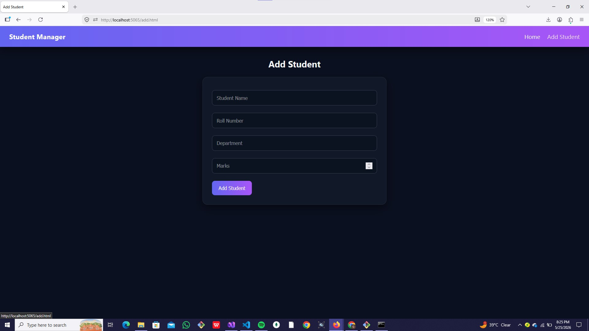
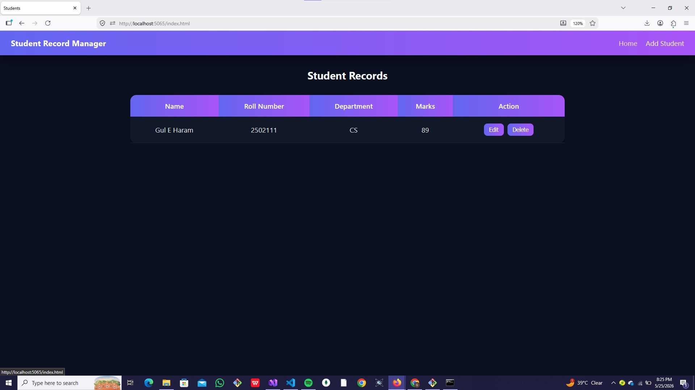
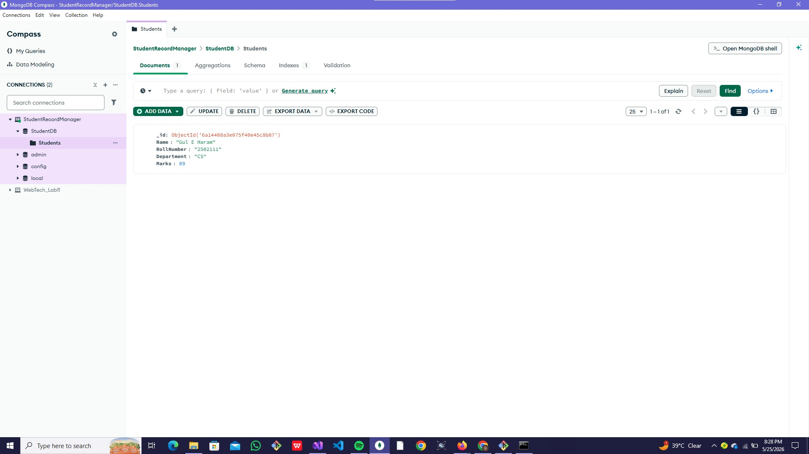

# Student Record Manager API

## Project Description
This is a full-stack Student Record Management System built using:
- ASP.NET Core Web API
- MongoDB Database
- HTML, CSS, JavaScript frontend

It allows users to:
- Add students
- View all students
- Update student records
- Delete students

---

## How to Run Project

### 1. Clone Repository
git clone https://github.com/YOUR_USERNAME/StudentRecordManagerAPI.git

### 2. Open Project
Open in Visual Studio or VS Code

### 3. Run Backend
dotnet run
API will run on: http://localhost:5065

---

## Frontend
Open: wwwroot/index.html

Or use Live Server extension.

---

## Database
MongoDB is used.

Make sure MongoDB is running locally: mongodb://localhost:27017

Database name: StudentDB

---

## Screenshots

### Add Student Page

### Student List Page

### Edit Feature

### MongoDB Data

---

## Note
This project uses real MongoDB database. Hardcoded data is NOT used.

---

## Author
Gul E Haram